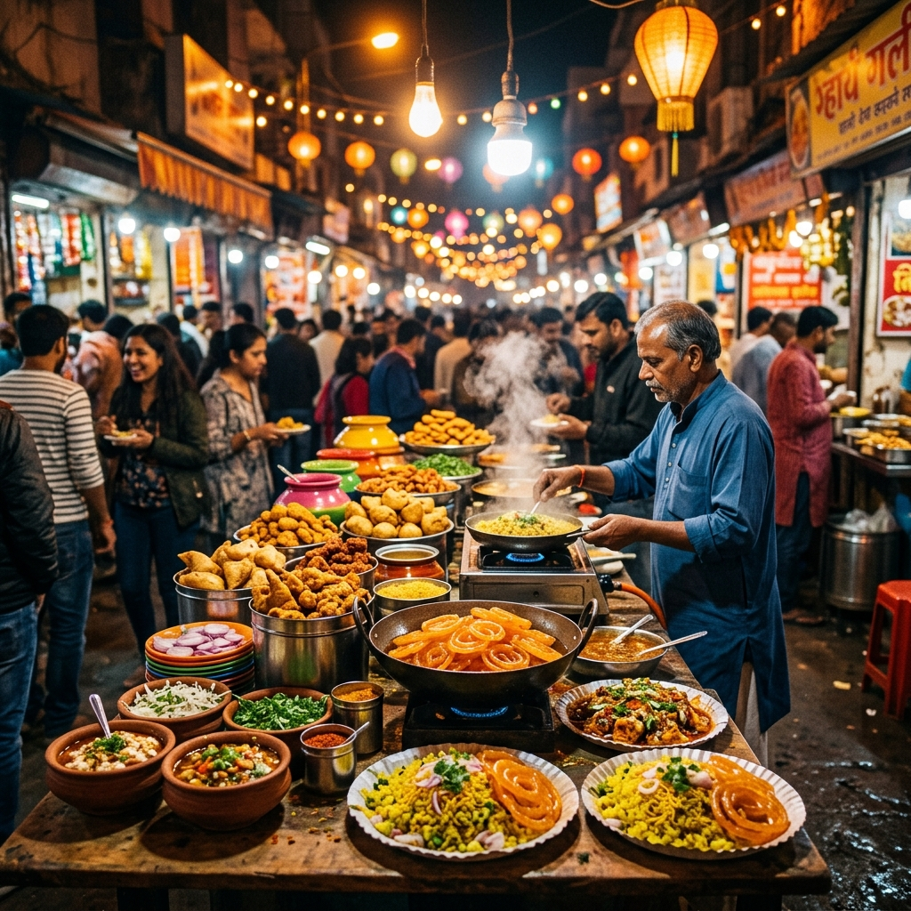
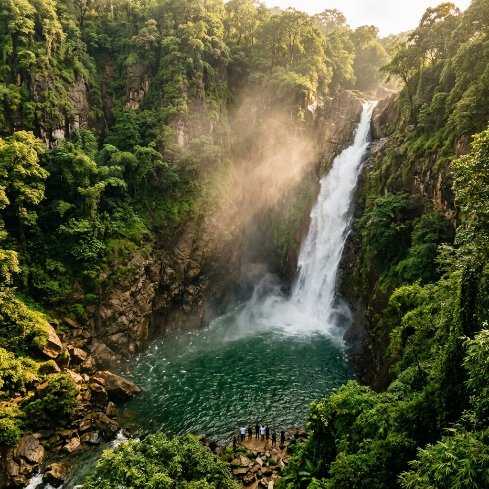

# CultureRoam — GenAI Travel Discovery Platform

> **Hackathon Project — GenAI Powered Cultural Tourism Platform**


## 🌏 Overview

**CultureRoam** is a Generative AI-powered platform that helps travelers discover destinations and engage with local culture in meaningful, immersive ways.

Using **Indore** as a flagship destination, the platform showcases:
- 🍛 **Food Discovery** — Sarafa Bazaar, Chappan Dukan, Morning Breakfast Culture
- 🏔️ **Nature & Waterfalls** — Patalpani, Tincha Falls, Ralamandal Wildlife Sanctuary
- 🚂 **Heritage Experiences** — The iconic Patalpani-Kalakund Heritage Train (monsoon season)
- 🤖 **AI Cultural Guide** — Chat with AI for itineraries, hidden gems, local events

## ✨ Features

| Feature | Description |
|---|---|
| 🔍 **AI Destination Search** | Type any Indian city and get an immersive AI-generated cultural guide |
| 📖 **Immersive Storytelling** | AI generates vivid stories for food zones, waterfalls, and heritage sites |
| 💬 **AI Chat Guide** | Ask anything about India — itineraries, hidden gems, festivals |
| 🏺 **Food Zone Explorer** | Interactive tabs for Sarafa, Chappan Dukan, and Breakfast culture |
| 🌿 **Nature Discovery** | Curated nature spots with AI-generated travel narratives |
| 🎭 **Heritage Promotion** | Dedicated section for the historic monsoon heritage train |
| 💎 **Hidden Gems** | AI uncovers offbeat places most tourists miss |

## 🤖 AI Stack

- **Primary**: [Pollinations.ai](https://pollinations.ai) — GPT-4o, completely free, no API key required
- **Fallback**: [Groq](https://console.groq.com) — Llama 3.3 70B, free tier (optional key via ⚡ button)
- **Offline**: Rich curated demo content always available

> No API key needed to use the platform — works out of the box!

## 🚀 Getting Started

### Option 1: Open directly
Just open `index.html` in any browser — or serve it locally:

```bash
npx serve . --listen 5500
# Open http://localhost:5500
```

### Option 2: Optional Groq Key (for faster AI)
1. Go to [console.groq.com](https://console.groq.com) — free signup, no credit card
2. Create an API key (`gsk_...`)
3. Click **⚡ Groq** in the navbar → paste key → Save

## 🗂️ Project Structure

```
cultureroam/
├── index.html          # Main application (semantic HTML5)
├── styles.css          # Full design system (dark theme, animations)
├── app.js              # Application logic + AI integration
└── assets/             # Generated images (hero, food, nature, heritage)
    ├── hero_banner.png
    ├── food_market.png
    ├── waterfall_nature.png
    ├── heritage_train.png
    └── temple_attraction.png
```

## 🏆 Evaluation Criteria Alignment

| Criteria | Implementation |
|---|---|
| **Code Quality** | Modular JS (StateManager, AIRouter, UI modules), strict mode, no globals |
| **Problem Alignment** | Full cultural tourism platform: food, nature, heritage, AI guide |
| **Security** | No keys exposed, XSS prevention (escapeHtml), rate limiting |
| **Efficiency** | Debounced events, IntersectionObserver lazy reveal, request timeouts |
| **Accessibility** | ARIA roles, live regions, keyboard navigation, reduced-motion support |

## 🛠️ Tech Stack

- **Frontend**: Vanilla HTML5, CSS3, JavaScript (ES2020+)
- **AI**: Pollinations.ai (GPT-4o) + Groq (Llama 3.3 70B)
- **Design**: Dark glassmorphism, CSS custom properties, micro-animations
- **Fonts**: Outfit + Playfair Display (Google Fonts)

## 📸 Screenshots

### Hero Section


### Food Culture (Sarafa Bazaar)


### Heritage Train


### Nature & Waterfalls


---

Built with ❤️ for **GenAI Hackathon 2026** | Powered by Groq & Pollinations AI
